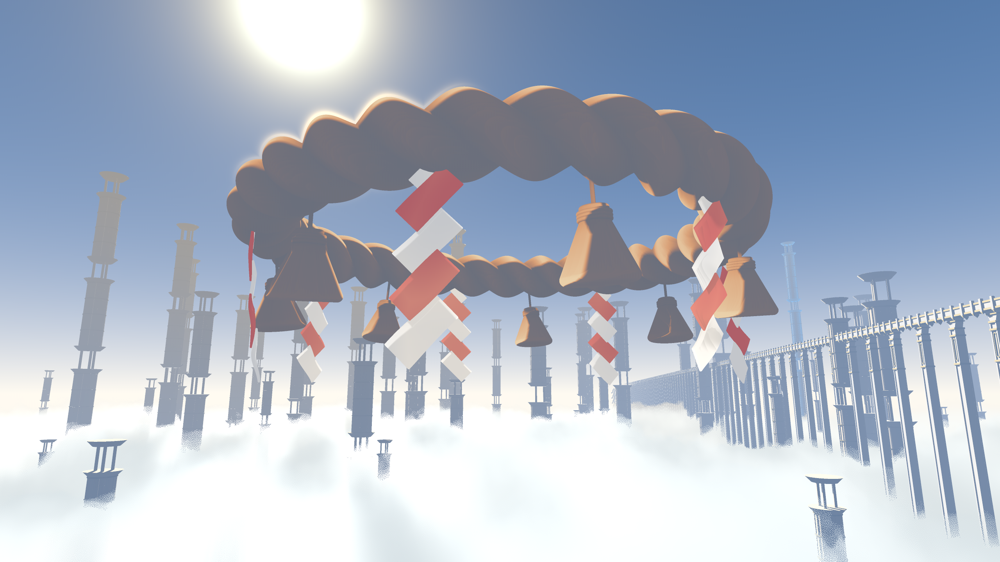
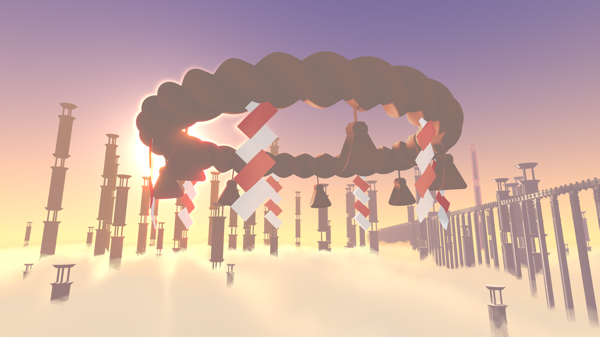
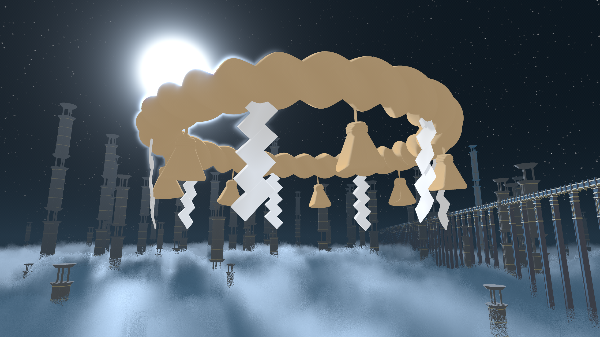

https://github.com/Skittss/Shimenawa/assets/62674524/76fec89e-ea3b-4b45-9607-28bfc9816354

# Shimenawa
Non-photo-realistically rendered scene using Raymarching and SDFs, meaning that everything you see is procedural! All surfaces are implicitly defined, with clouds being based on physically-based volume rendering techniques, adjusted for artistic control. 

Inspired from Genshin Impact's main menu and 'slumbering court' locale.

For more info and implementation details, check out [this blog post!](https://skittss.github.io/PortfolioWebsite/#/projects/Shimenawa)
  

# Running / Viewing
Accessible on shadertoy [here.](https://www.shadertoy.com/view/clVyzW)
  

# Techniques Used

- Raymarching
- Signed distance functions or "SDFs" (implicit surfaces). Including many complexities such as:
    -   Fast soft shadows
    -   Ambient Occlusion
    -   Fast and simple sub-surface scattering
    -   Acceleration structures (Bounding boxes, and LOD)
    -   Domain warping, for procedural detail and animation.
    -   [Domain repetition](http://iquilezles.org/articles/sdfrepetition/) (for performance)
- HDR Rendering, including buffer pass bloom
- LDR Post-processing
- Volume Rendering (for clouds), inspired by PBR techniques and particularly cloud systems developed by [Guerilla Games](https://www.guerrilla-games.com/read/the-real-time-volumetric-cloudscapes-of-horizon-zero-dawn).

and lots, and lots of maths!

I explain each of these techniques in more detail [here.](https://skittss.github.io/PortfolioWebsite/#/projects/Shimenawa)
  

# Colour Schemes

I additionally made day, sunset and night colour schemes, please check them out! :)

(click for full-size)
